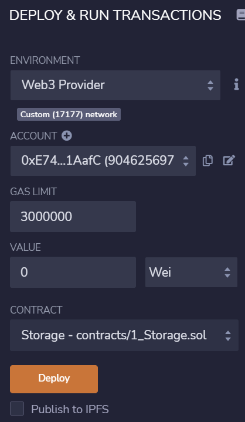

# Create a private blockchain

The goal of this short project is to demonstrate how to create a private network and run it locally. The network will be composed out of 3 nodes:

- `node1` will be a miner
- `node2` will be a xxx
- the third node will be the `bootnode` allowing nodes to connect together

## Create the folder structure

First, create a root folder and name it at your convenience. For illustration, I'll name it `PrivateBC`. Inside this folder, create 2 more folders named `node1` and `node2`.

Inside your project root folder, create a file named `info.txt`.

You project structure should look like this:
```
+- PrivateBC
  +- node1
  +- node2
  -  info.txt
```

## Create the nodes accounts

The next step consists of creating an EOA for each node. It is a mandatory step as node operators might receive a reward for mining a block.

Run the following command and enter a password:

```
> geth --datadir "./data" account new

INFO [02-17|21:51:52.782] Maximum peer count                       ETH=50 LES=0 total=50
Your new account is locked with a password. Please give a password. Do not forget this password.
Password:                                                                                       
Repeat password: 

Your new key was generated

Public address of the key:   0xE744b654225f2b0311546bE751b5eaa4d201AafC
Path of the secret key file: data\keystore\UTC--2022-02-17T20-52-04.562583400Z--e744b654225f2b0311546be751b5eaa4d201aafc

- You can share your public address with anyone. Others need it to interact with you.
- You must NEVER share the secret key with anyone! The key controls access to your funds!
- You must BACKUP your key file! Without the key, it's impossible to access account funds!
- You must REMEMBER your password! Without the password, it's impossible to decrypt the key!

```

Go on and copy the node1 address in the text file as well as the password (just used for the exercice):

```
Public address of the key:   0xE744b654225f2b0311546bE751b5eaa4d201AafC
Password: 123456789
```

Repeat these steps inside the folder node2.

```
> geth --datadir "./data" account new
...
Public address of the key:   0xc44e7F61723E1927c281618302acE0E13e12b06e
Password: 123456789
```

## Generate the Genesis Block configuration file

For this part, we will help ourselves by using the puppeth assistant. Simply type the following command in your terminal and follow the instructions:
```
> puppeth

+-----------------------------------------------------------+
| Welcome to puppeth, your Ethereum private network manager |
|                                                           |
| This tool lets you create a new Ethereum network down to  |
| the genesis block, bootnodes, miners and ethstats servers |
| without the hassle that it would normally entail.         |
|                                                           |
| Puppeth uses SSH to dial in to remote servers, and builds |
| its network components out of Docker containers using the |
| docker-compose toolset.                                   |
+-----------------------------------------------------------+
```

Select a network name that complies with the rules:
```
Please specify a network name to administer (no spaces, hyphens or capital letters please)
> codefrite

Sweet, you can set this via --network=codefrite next time!

INFO [02-17|22:18:15.989] Administering Ethereum network           name=codefrite
WARN [02-17|22:18:16.015] No previous configurations found         path=.puppeth\codefrite
```

Then, select the option `2` to begin configuring the genesis block:
```
What would you like to do? (default = stats)
 1. Show network stats
 2. Configure new genesis
 3. Track new remote server
 4. Deploy network components
> 2
```

Then, select the option `1` to begin configuring the genesis block from scratch:
```
What would you like to do? (default = create)
 1. Create new genesis from scratch
 2. Import already existing genesis
> 1
```

Then, select the option `2` to make your BC use the proof-of-authority as its consensus engine. This option is more suitable for a private network but feel free to experiment with both options:
```
Which consensus engine to use? (default = clique)
1. Ethash - proof-of-work
2. Clique - proof-of-authority
> 2
```

Then, set the time between two blocks generation in seconds:
```
How many seconds should blocks take? (default = 15)
> 30
```

Then, define the miner account and press `enter` twice:
```
Which accounts are allowed to seal? (mandatory at least one)
> 0xE744b654225f2b0311546bE751b5eaa4d201AafC
> 0x
```

Prefund both nodes account:
```
Which accounts should be pre-funded? (advisable at least one)
> 0xE744b654225f2b0311546bE751b5eaa4d201AafC
> 0xc44e7F61723E1927c281618302acE0E13e12b06e
> 0x
```

Answer `yes` to the following question:
```
Should the precompile-addresses (0x1 .. 0xff) be pre-funded with 1 wei? (advisable yes)
> yes
```

Specify a chain id, for example `17177`:
```
Specify your chain/network ID if you want an explicit one (default = random)
> 17177
INFO [02-17|23:11:54.072] Configured new genesis block 
```

The new genesis block configuration file has now been created under the folder `.puppeth` under the filename of the blockchain specified in step 1.

You project structure should look like this:
```
+- PrivateBC
  +- .puppeth
    -  codefrite
  +- node1
  +- node2
  -  info.txt
```

## Export the genesis configuration file 

Select the option `2` to manage the genesis configuration we have just created:
```
What would you like to do? (default = stats)
 1. Show network stats
 2. Manage existing genesis
 3. Track new remote server
 4. Deploy network components
> 2
```

Now, select the option `2` to export the config:
```
 1. Modify existing configurations
 2. Export genesis configurations
 3. Remove genesis configuration
> 2
```

Now, define the folder name to where your genesis specifications will be exported:
```
Which folder to save the genesis specs into? (default = current)
  Will create codefrite.json, codefrite-aleth.json, codefrite-harmony.json, codefrite-parity.json
> codefrite

INFO [02-18|07:09:39.155] Saved native genesis chain spec          path=codefrite\codefrite.json
ERROR[02-18|07:09:39.155] Failed to create Aleth chain spec        err="unsupported consensus engine"
ERROR[02-18|07:09:39.156] Failed to create Parity chain spec       err="unsupported consensus engine"
INFO [02-18|07:09:39.157] Saved genesis chain spec                 client=harmony path=codefrite\codefrite-harmony.json
```

You project structure should look like this:
```
+- PrivateBC
  +- .puppeth
    -  codefrite
  +- codefrite
    -  codefrite.json
    -  codefrite-harmony.json
  +- node1
  +- node2
  -  info.txt
```

## Initializing the nodes with the exported configuration

Navigate to the `node1` folder and run it:
```
> cd node1
> geth --datadir ./data init ../codefrite/codefrite.json

INFO [02-18|07:19:29.232] Maximum peer count                       ETH=50 LES=0 total=50
INFO [02-18|07:19:29.297] Set global gas cap                       cap=50,000,000
INFO [02-18|07:19:29.297] Allocated cache and file handles         database=C:\Users\Hadi\go\src\PrivateBC\node1\data\geth\chaindata cache=16.00MiB handles=16
INFO [02-18|07:19:29.484] Writing custom genesis block 
INFO [02-18|07:19:29.499] Persisted trie from memory database      nodes=357 size=50.70KiB time=3.4028ms gcnodes=0 gcsize=0.00B gctime=0s livenodes=1 livesize=0.00B
INFO [02-18|07:19:29.501] Successfully wrote genesis state         database=chaindata hash=106172..c21f45
INFO [02-18|07:19:29.501] Allocated cache and file handles         database=C:\Users\Hadi\go\src\PrivateBC\node1\data\geth\lightchaindata cache=16.00MiB handles=16
INFO [02-18|07:19:29.649] Writing custom genesis block 
INFO [02-18|07:19:29.659] Persisted trie from memory database      nodes=357 size=50.70KiB time=2.0931ms gcnodes=0 gcsize=0.00B gctime=0s livenodes=1 livesize=0.00B
INFO [02-18|07:19:29.660] Successfully wrote genesis state         database=lightchaindata hash=106172..c21f45
```

You node folder should look like this:
```
+- node1
  +- data
    +- geth
      +- chaindata
      +- lightchaindata
    +- keystore
```

Navigate to the node2 folder and run the same command:
```
> cd node2
> geth --datadir ./data init ../codefrite/codefrite.json

INFO [02-18|07:25:39.999] Maximum peer count                       ETH=50 LES=0 total=50
INFO [02-18|07:25:40.030] Set global gas cap                       cap=50,000,000
INFO [02-18|07:25:40.031] Allocated cache and file handles         database=C:\Users\Hadi\go\src\PrivateBC\node2\data\geth\chaindata cache=16.00MiB handles=16
INFO [02-18|07:25:40.188] Writing custom genesis block 
INFO [02-18|07:25:40.199] Persisted trie from memory database      nodes=357 size=50.70KiB time=2.7186ms gcnodes=0 gcsize=0.00B gctime=0s livenodes=1 livesize=0.00B
INFO [02-18|07:25:40.216] Successfully wrote genesis state         database=chaindata hash=106172..c21f45
INFO [02-18|07:25:40.216] Allocated cache and file handles         database=C:\Users\Hadi\go\src\PrivateBC\node2\data\geth\lightchaindata cache=16.00MiB handles=16
INFO [02-18|07:25:40.388] Writing custom genesis block 
INFO [02-18|07:25:40.397] Persisted trie from memory database      nodes=357 size=50.70KiB time=2.1761ms gcnodes=0 gcsize=0.00B gctime=0s livenodes=1 livesize=0.00B
INFO [02-18|07:25:40.399] Successfully wrote genesis state         database=lightchaindata hash=106172..c21f45
```

## Initializing the bootnode

A bootnode is used to keep track on the nodes and allow them to connect to each others.

Go on and create a new folder inside your root directory named `bnode`. You project structure should look like this:
```
+- PrivateBC
  +- .puppeth
  +- bnode
  +- codefrite
  +- node1
  +- node2
  -  info.txt
```

Then, navigate inside it and generate a bootkey:
```
> bootnode -genkey boot.key
```

A new file `boot.key` will be created inside your `bnode` folder.

## Starting the bootnode

Start the bootnode with the following command:
```
> bootnode -nodekey boot.key -verbosity 7 -addr "127.0.0.1:30301"

enode://659ec0b3130cddc70da0f3c098cd244c6fa819738b013001d253191a8370e3a00652d5a0c58b58c0dd2a8766bc2699a1b113844dbda5343b9881ccd5cae12cc8@127.0.0.1:0?discport=30301
Note: you're using cmd/bootnode, a developer tool.
We recommend using a regular node as bootstrap node for production deployments.
INFO [02-18|07:52:19.974] New local node record                    seq=1,645,167,139,974 id=f35f4a451cc3330a ip=<nil> udp=0 tcp=0
```

Go ahead and copy the `enode` address in the `info.txt` file:

## Connecting the nodes

First, let's create a `password.txt` file inside the `node1` folder. Then, copy the `node1` password into it, in my case `123456789`.

Repeat these steps for `node2`.

Now, in a new terminal window, navigate to `node1` folderand run the following command: 
```
> cd node1
> geth console 
    --networkid 17177 
    --datadir ./data 
    --bootnodes enode://659ec0b3130cddc70da0f3c098cd244c6fa819738b013001d253191a8370e3a00652d5a0c58b58c0dd2a8766bc2699a1b113844dbda5343b9881ccd5cae12cc8@127.0.0.1:30301
    --port 30303
    --allow-insecure-unlock
    --ipcdisable
    --syncmode full
    --http
    --http.corsdomain "*"
    --http.port 8545
    --unlock 0xE744b654225f2b0311546bE751b5eaa4d201AafC
    --password password.txt
    --mine
```

You should get the following output:
```
node1> geth --networkid 17177 --datadir "./data" --bootnodes enode://659ec0b3130cddc70da0f3c098cd244c6fa819738b013001d253191a8370e3a00652d5a0c58b58c0dd2a8766bc2699a1b113
844dbda5343b9881ccd5cae12cc8@127.0.0.1:30301 --port 30303 --ipcdisable --syncmode full --allow-insecure-unlock --http --http.corsdomain "*" --http.port 8545 --unlock 0xE744b654225f2b0311546bE751b5eaa4d20
1AafC --password password.txt --mine console
INFO [02-18|14:13:24.401] Maximum peer count                       ETH=50 LES=0 total=50
INFO [02-18|14:13:24.447] Set global gas cap                       cap=50,000,000
INFO [02-18|14:13:24.447] Allocated trie memory caches             clean=154.00MiB dirty=256.00MiB
INFO [02-18|14:13:24.448] Allocated cache and file handles         database=C:\Users\Hadi\go\src\PrivateBC\node1\data\geth\chaindata cache=512.00MiB handles=8192
INFO [02-18|14:13:24.647] Opened ancient database                  database=C:\Users\Hadi\go\src\PrivateBC\node1\data\geth\chaindata\ancient readonly=false
INFO [02-18|14:13:24.678] Initialised chain configuration          config="{ChainID: 17177 Homestead: 0 DAO: <nil> DAOSupport: false EIP150: 0 EIP155: 0 EIP158: 0 Byzantium: 0 Constantinople: 0 Petersbur
g: 0 Istanbul: 0, Muir Glacier: <nil>, Berlin: <nil>, London: <nil>, Arrow Glacier: <nil>, MergeFork: <nil>, Engine: clique}"
INFO [02-18|14:13:24.723] Initialising Ethereum protocol           network=17177 dbversion=8
INFO [02-18|14:13:24.744] Loaded most recent local header          number=165 hash=078e91..687008 td=331 age=20s
INFO [02-18|14:13:24.745] Loaded most recent local full block      number=165 hash=078e91..687008 td=331 age=20s
INFO [02-18|14:13:24.745] Loaded most recent local fast block      number=165 hash=078e91..687008 td=331 age=20s
INFO [02-18|14:13:24.773] Loaded local transaction journal         transactions=0 dropped=0
INFO [02-18|14:13:24.773] Regenerated local transaction journal    transactions=0 accounts=0
INFO [02-18|14:13:24.773] Gasprice oracle is ignoring threshold set threshold=2
WARN [02-18|14:13:24.773] Unclean shutdown detected                booted=2022-02-18T12:37:08+0100 age=1h36m16s
WARN [02-18|14:13:24.773] Unclean shutdown detected                booted=2022-02-18T12:38:18+0100 age=1h35m6s
INFO [02-18|14:13:24.773] Starting peer-to-peer node               instance=Geth/v1.10.16-unstable/windows-amd64/go1.17.6
INFO [02-18|14:13:24.951] New local node record                    seq=1,645,184,228,206 id=541ca61f800abef5 ip=127.0.0.1 udp=30303 tcp=30303
INFO [02-18|14:13:24.952] Started P2P networking                   self=enode://8ca594492ef233e9748b7645bc13608296317d7e2fa54a24574e01b07d5b43b41f3b7c2d611d5e4b9a7386a5c4e455eb8e09b6e9aa9529c900d96535a55
e62c0@127.0.0.1:30303
INFO [02-18|14:13:24.983] HTTP server started                      endpoint=127.0.0.1:8545 prefix= cors=* vhosts=localhost
INFO [02-18|14:13:25.720] Unlocked account                         address=0xE744b654225f2b0311546bE751b5eaa4d201AafC
INFO [02-18|14:13:25.730] Transaction pool price threshold updated price=1,000,000,000
INFO [02-18|14:13:25.730] Updated mining threads                   threads=0
INFO [02-18|14:13:25.730] Transaction pool price threshold updated price=1,000,000,000
INFO [02-18|14:13:25.730] Etherbase automatically configured       address=0xE744b654225f2b0311546bE751b5eaa4d201AafC
Welcome to the Geth JavaScript console!

instance: Geth/v1.10.16-unstable/windows-amd64/go1.17.6
coinbase: 0xe744b654225f2b0311546be751b5eaa4d201aafc
at block: 165 (Fri Feb 18 2022 14:13:04 GMT+0100 (CET))
datadir: C:\Users\Hadi\go\src\PrivateBC\node1\data
modules: admin:1.0 clique:1.0 debug:1.0 eth:1.0 miner:1.0 net:1.0 personal:1.0 rpc:1.0 txpool:1.0 web3:1.0
To exit, press ctrl-d or type exit
```

After creation, the miner node will begin to compute sealing work. If the block is not yet filled and if a new transaction reaches the node, it will compute a new sealing work and submit it to the network. When the time to create the new block is reached, miner will check inside the sealing work items and select the correct and most recent one. The block will be mined and the miner rewarded.    

In parallel, the node will look for new peers.
```
INFO [02-18|14:27:34.011] Commit new sealing work                  number=195 sealhash=b1721a..64f185 uncles=0 txs=0 gas=0 fees=0 elapsed=1.041ms
INFO [02-18|14:27:41.216] Looking for peers                        peercount=1 tried=0 static=0
INFO [02-18|14:27:51.459] Looking for peers                        peercount=1 tried=0 static=0
INFO [02-18|14:28:01.720] Looking for peers                        peercount=1 tried=0 static=0
INFO [02-18|14:28:04.007] Successfully sealed new block            number=195 sealhash=b1721a..64f185 hash=4e1423..98c668 elapsed=29.997s
INFO [02-18|14:28:04.008] 🔗 block reached canonical chain          number=188 hash=beaa8a..2f0001
INFO [02-18|14:28:04.008] 🔨 mined potential block                  number=195 hash=4e1423..98c668
INFO [02-18|14:28:04.008] Commit new sealing work                  number=196 sealhash=d7d04a..836f2b uncles=0 txs=0 gas=0 fees=0 elapsed="520.7µs"
INFO [02-18|14:28:04.008] Commit new sealing work                  number=196 sealhash=d7d04a..836f2b uncles=0 txs=0 gas=0 fees=0 elapsed="520.7µs"

```

Finally, in a new terminal window, navigate to `node2` folder and run the following command:
```
> cd node2
> geth console 
    --networkid 17177 
    --datadir ./data 
    --bootnodes enode://659ec0b3130cddc70da0f3c098cd244c6fa819738b013001d253191a8370e3a00652d5a0c58b58c0dd2a8766bc2699a1b113844dbda5343b9881ccd5cae12cc8@127.0.0.1:30301
    --port 30304
    --allow-insecure-unlock
    --ipcdisable
    --syncmode full
    --http
    --http.corsdomain "*"
    --http.port 8546
    --unlock 0xc44e7F61723E1927c281618302acE0E13e12b06e
    --password password.txt
```

Please note that we are using different ports, a different wallet address and that we are node using the flag `--mine` as node2 is not a miner.
```
You should get the following output:
node2> geth --networkid 17177 --datadir ./data --bootnodes enode://659ec0b3130cddc70da0f3c098cd244c6fa819738b013001d253191a8370e3a00652d5a0c58b58c0dd2a8766bc2699a1b11384
4dbda5343b9881ccd5cae12cc8@127.0.0.1:30301 --port 30304 --allow-insecure-unlock --ipcdisable --syncmode full --http --http.corsdomain "*" --http.port 8546 --unlock 0xc44e7F61723E1927c281618302acE0E13e12b
06e --password password.txt console

INFO [02-18|14:16:47.721] Maximum peer count                       ETH=50 LES=0 total=50
INFO [02-18|14:16:47.778] Set global gas cap                       cap=50,000,000
INFO [02-18|14:16:47.778] Allocated trie memory caches             clean=154.00MiB dirty=256.00MiB
INFO [02-18|14:16:47.778] Allocated cache and file handles         database=C:\Users\Hadi\go\src\PrivateBC\node2\data\geth\chaindata cache=512.00MiB handles=8192
INFO [02-18|14:16:48.031] Opened ancient database                  database=C:\Users\Hadi\go\src\PrivateBC\node2\data\geth\chaindata\ancient readonly=false
INFO [02-18|14:16:48.049] Initialised chain configuration          config="{ChainID: 17177 Homestead: 0 DAO: <nil> DAOSupport: false EIP150: 0 EIP155: 0 EIP158: 0 Byzantium: 0 Constantinople: 0 Petersbur
g: 0 Istanbul: 0, Muir Glacier: <nil>, Berlin: <nil>, London: <nil>, Arrow Glacier: <nil>, MergeFork: <nil>, Engine: clique}"
INFO [02-18|14:16:48.062] Initialising Ethereum protocol           network=17177 dbversion=8
INFO [02-18|14:16:48.108] Loaded most recent local header          number=154 hash=0031f3..08417f td=309 age=9m14s
INFO [02-18|14:16:48.108] Loaded most recent local full block      number=154 hash=0031f3..08417f td=309 age=9m14s
INFO [02-18|14:16:48.108] Loaded most recent local fast block      number=154 hash=0031f3..08417f td=309 age=9m14s
INFO [02-18|14:16:48.129] Loaded local transaction journal         transactions=0 dropped=0
INFO [02-18|14:16:48.131] Regenerated local transaction journal    transactions=0 accounts=0
INFO [02-18|14:16:48.142] Gasprice oracle is ignoring threshold set threshold=2
INFO [02-18|14:16:48.143] Starting peer-to-peer node               instance=Geth/v1.10.16-unstable/windows-amd64/go1.17.6
INFO [02-18|14:16:48.299] New local node record                    seq=1,645,185,653,642 id=675259ab3fd07b3f ip=127.0.0.1 udp=30304 tcp=30304
INFO [02-18|14:16:48.300] Started P2P networking                   self=enode://6621856d4f6eaeca5a4f8b37c539cdfac5f4a40ebe2205a750e4bbf932a1c21fc77001467a6fc42a9d61664fceb74b1bcde938b120ce308efe6930aae1c
23f15@127.0.0.1:30304
INFO [02-18|14:16:48.302] HTTP server started                      endpoint=127.0.0.1:8546 prefix= cors=* vhosts=localhost
INFO [02-18|14:16:49.090] Unlocked account                         address=0xc44e7F61723E1927c281618302acE0E13e12b06e
INFO [02-18|14:16:49.180] Etherbase automatically configured       address=0xc44e7F61723E1927c281618302acE0E13e12b06e
Welcome to the Geth JavaScript console!

instance: Geth/v1.10.16-unstable/windows-amd64/go1.17.6
coinbase: 0xc44e7f61723e1927c281618302ace0e13e12b06e
at block: 154 (Fri Feb 18 2022 14:07:34 GMT+0100 (CET))
datadir: C:\Users\Hadi\go\src\PrivateBC\node2\data
modules: admin:1.0 clique:1.0 debug:1.0 eth:1.0 miner:1.0 net:1.0 personal:1.0 rpc:1.0 txpool:1.0 web3:1.0

To exit, press ctrl-d or type exit
```

As we can see, since this block is not a miner, it will only import new chain segments and look for new peers:

```
INFO [02-18|14:16:58.320] Block synchronisation started
INFO [02-18|14:16:58.338] Downloader queue stats                   receiptTasks=0 blockTasks=0 itemSize=562.19B throttle=8192
INFO [02-18|14:16:58.346] Imported new chain segment               blocks=18 txs=0 mgas=0.000 elapsed=7.133ms mgasps=0.000 number=172 hash=1f8ca2..81dadd dirty=0.00B     ignored=1
INFO [02-18|14:16:58.524] Looking for peers                        peercount=1 tried=1 static=0
INFO [02-18|14:17:04.021] Imported new chain segment               blocks=1  txs=0 mgas=0.000 elapsed="578.7µs" mgasps=0.000 number=173 hash=7bc5d8..d93269 dirty=0.00B
INFO [02-18|14:17:08.661] Looking for peers                        peercount=1 tried=0 static=0
INFO [02-18|14:17:18.858] Looking for peers                        peercount=1 tried=0 static=0
INFO [02-18|14:17:29.039] Looking for peers                        peercount=1 tried=0 static=0
INFO [02-18|14:17:34.005] Imported new chain segment               blocks=1  txs=0 mgas=0.000 elapsed="555.1µs" mgasps=0.000 number=174 hash=a66ace..3c8f3d dirty=0.00B
INFO [02-18|14:17:39.182] Looking for peers                        peercount=1 tried=0 static=0
```

If we head up to the bootnode console, we can see that both node1 and node2 are pinging and querying for new neighbors. We can check by their identity by their ports `30303` and `30304`. This indicates that they are up and running.
```
TRACE[02-18|14:39:19.496] >> PING/v4                               id=675259ab3fd07b3f addr=127.0.0.1:30304 err=nil
TRACE[02-18|14:39:19.497] << PONG/v4                               id=675259ab3fd07b3f addr=127.0.0.1:30304 err=nil

TRACE[02-18|14:39:17.992] << PING/v4                               id=541ca61f800abef5 addr=127.0.0.1:30303 err=nil
TRACE[02-18|14:39:17.992] >> PONG/v4                               id=541ca61f800abef5 addr=127.0.0.1:30303 err=nil

TRACE[02-18|14:39:18.043] << FINDNODE/v4                           id=675259ab3fd07b3f addr=127.0.0.1:30304 err=nil
TRACE[02-18|14:39:18.043] >> NEIGHBORS/v4                          id=675259ab3fd07b3f addr=127.0.0.1:30304 err=nil
TRACE[02-18|14:39:18.420] << FINDNODE/v4                           id=541ca61f800abef5 addr=127.0.0.1:30303 err=nil
TRACE[02-18|14:39:18.421] >> NEIGHBORS/v4                          id=541ca61f800abef5 addr=127.0.0.1:30303 err=nil

TRACE[02-18|14:49:40.841] << ENRREQUEST/v4                         id=675259ab3fd07b3f addr=127.0.0.1:30304 err=nil
TRACE[02-18|14:49:40.841] >> ENRRESPONSE/v4                        id=675259ab3fd07b3f addr=127.0.0.1:30304 err=nil
TRACE[02-18|14:39:17.993] << ENRREQUEST/v4                         id=541ca61f800abef5 addr=127.0.0.1:30303 err=nil
TRACE[02-18|14:39:17.994] >> ENRRESPONSE/v4                        id=541ca61f800abef5 addr=127.0.0.1:30303 err=nil

DEBUG[02-18|14:39:19.497] Revalidated node                         b=16 id=675259ab3fd07b3f checks=2
```

## Deploy a contract on your Private BlockChain

Let's head up to Remix and compile the `SimpleStorage.sol` example contract. Then, open the migration tab, select as an environment `Web3 Provider` and migrate the contract:



In the `node1` miner console, you should see the corresponding transaction:
```
INFO [02-18|15:25:21.091] Setting new local account                address=0xE744b654225f2b0311546bE751b5eaa4d201AafC
INFO [02-18|15:25:21.092] Submitted contract creation              hash=0xfa700d86a2a3a482984225f4cca59e5dbba49063f682929de26b45ece52b9039 from=0xE744b654225f2b0311546bE751b5eaa4d201AafC nonce=20 contrac
t=0xD90dD95b3569A4CF161248591768d5E4b631544b value=0
INFO [02-18|15:25:22.005] Commit new sealing work                  number=310 sealhash=c76a31..4ec04f uncles=0 txs=1 gas=125,677 fees=0.000125677 elapsed=0s
INFO [02-18|15:25:34.000] Successfully sealed new block            number=310 sealhash=c76a31..4ec04f hash=9cb69c..ac4961 elapsed=11.995s
INFO [02-18|15:25:34.001] 🔨 mined potential block                  number=310 hash=9cb69c..ac4961
```

In the `node2` console, we can see the new block being imported. It contains a single transaction and some gas:
```
INFO [02-18|15:25:04.002] Imported new chain segment               blocks=1 txs=0 mgas=0.000 elapsed="536.6µs" mgasps=0.000 number=309 hash=934213..fbc295 dirty=0.00B
INFO [02-18|15:25:34.002] Imported new chain segment               blocks=1 txs=1 mgas=0.126 elapsed=1.088ms   mgasps=115.459 number=310 hash=9cb69c..ac4961 dirty=1.92KiB
```
